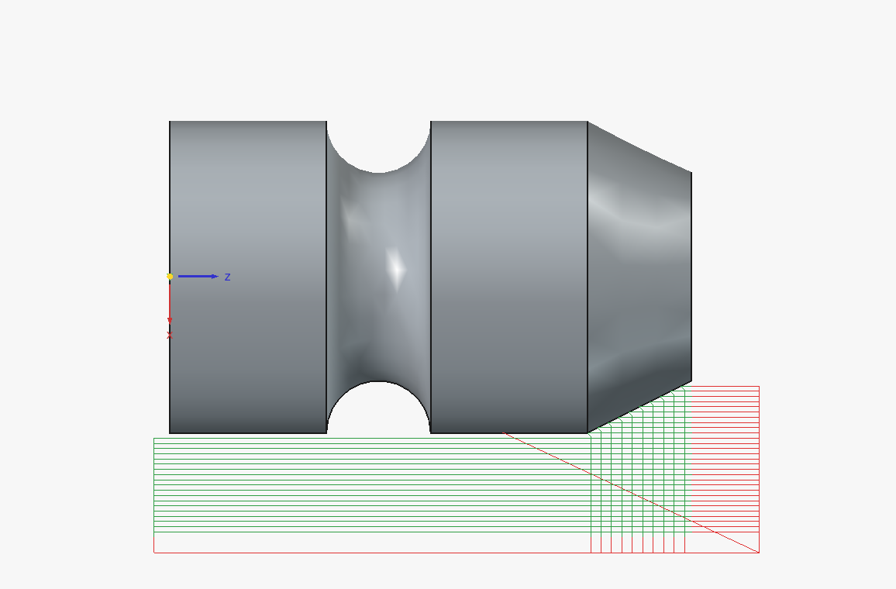
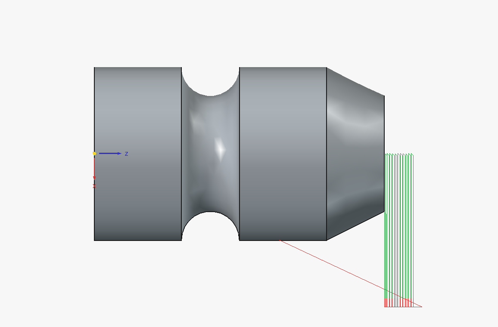
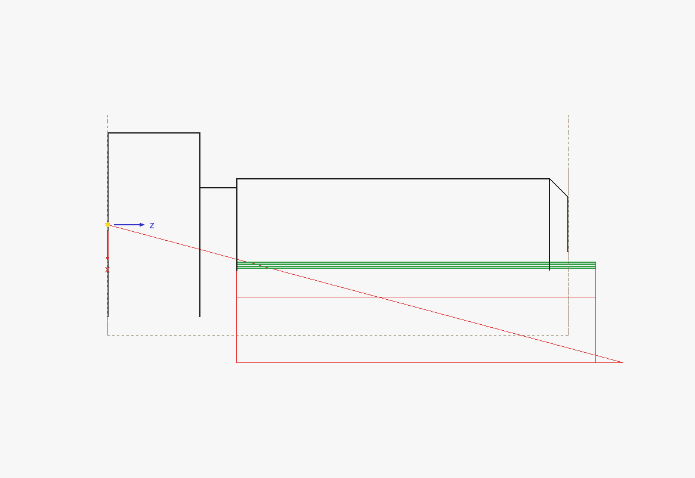
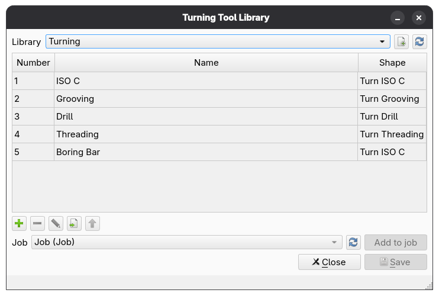

# FreeCAD Turning Addon

A FreeCAD CAM workbench addon for creating CNC lathe toolpaths.

> **Experimental:** This addon is under development. Review and verify every toolpath before machining.

## Features

- Roughing: clears material with axial or radial cuts, including facing and grooving
- Profiling: follows the part shape with offset passes
- Chamfering: equal-distance 45-degree edge breaks
- Drilling: drills holes on the spindle centreline
- Threading: cuts external threads (does not currently produce valid G-code; see [#65](https://github.com/dubstar-04/TurningAddon/issues/65))
- Parting: cuts through the workpiece to separate a finished part
- Tool Library: Create and edit turning tools.
- Simulation: Preview and navigate toolpaths.
- Containment: Set machining limits for each operation.
- Remaining Stock: View stock before or after an operation.

## Requirements

- FreeCAD 26.3 or later
- [LibLathe](https://pypi.org/project/liblathe/)

The addon is available from **CAM > CAM Addons > Turning Addon**.

## Turning operations

<table>
  <tr>
    <td align="center"><strong>Roughing</strong> </td>
    <td align="center"><strong>Facing</strong> </td>
  </tr>
  <tr>
    <td align="center"><strong>Grooving</strong> </td>
    <td align="center"><strong>Profiling</strong> </td>
  </tr>
  <tr>
    <td align="center"><strong>Boring</strong> </td>
    <td align="center"><strong>Threading</strong> </td>
  </tr>
</table>

### Tool Management

- Use the **Turning Tool Library** to create and edit tools.

### Containment

- Containment sets the area an operation can machine.
- While editing, a section view shows the limits on the model.
- Drag the handles to change a limit.
- Handles snap to model edges.

### Remaining Stock

- View stock before or after an operation.

### Simulation

- Choose which operations to simulate.
- Click an operation to jump to it.
- Scrub the timeline.
- Step forward or back 1 mm.
- Skip to the previous or next operation.
- Choose a simulation engine. More than one engine is available to help with development and testing.

## License

[LGPL-2.1](LICENSE)
